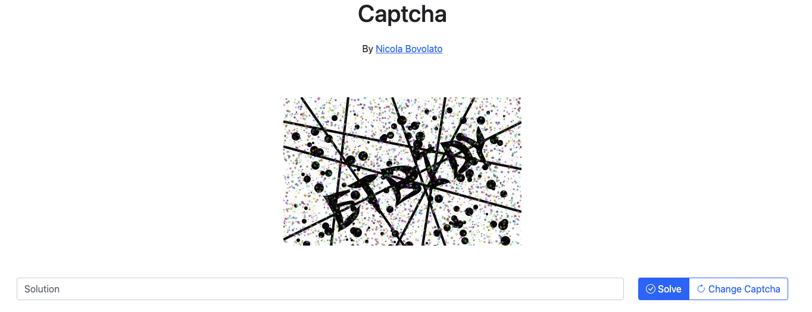

# Captcha

Simple captcha service powered by modern technologies

### Run the app

-   `docker-compose up -d`
-   Visit [localhost](http://localhost)
-   Or visit the url specified in `docker-compose logs localtunnel`

## Technologies

### [Frontend](./frontend/)

-   `React`
-   `Bootstrap`
-   `Bootstrap Icons`

### [Backend](./api/)

-   `Typescript`
-   `TSyringe`
-   `Jest`
-   `Fastify`
-   `Redis`

### Putting it all together

-   `Docker`
-   `docker-compose`
-   `localtunnel`
